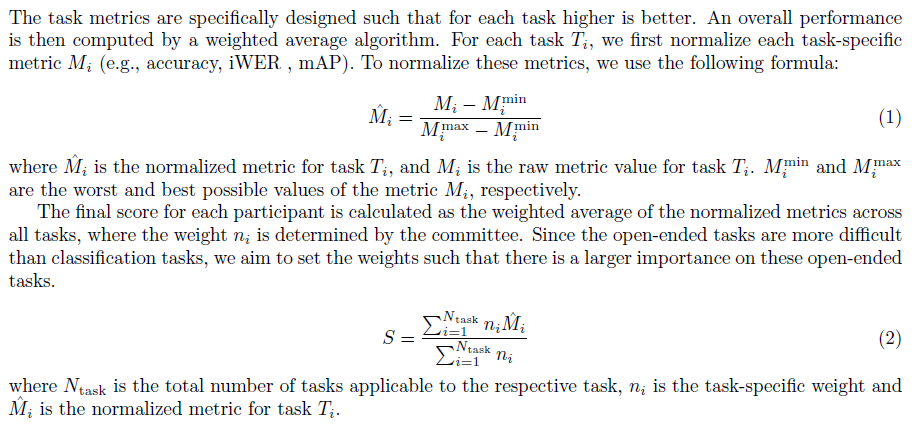

# The Interspeech 2026 Audio Encoder Capability Challenge for Large Audio Language Models

## Overview

The **Interspeech 2026 Audio Encoder Capability Challenge**, hosted by Xiaomi, University of Surrey, Tsinghua University and Dataocean AI, evaluates pre-trained audio encoders as front-end modules for LALMs, focusing on their ability to understand and represent audio semantics in complex scenarios.

The challenge adopts a unified end-to-end generative evaluation framework. Participants only need to submit a pre-trained encoder model, while the downstream task training and evaluation are completed by the organizers. The organizers provide  [XARES-LLM benchmark](https://github.com/xiaomi-research/xares-llm.git), an open-source evaluation system. XARES-LLM trains a typical LALM using the audio encoder provided by the user. The system automatically downloads training data, trains the LALM then tests various downstream tasks, providing scores for each. The XARES-LLM system is depicted in Figure below.

**The only mandatory task for all participants is to encapsulate their encoder according to the framework requirements properly.**

Training is done by jointly training on all datasets using a predefined mixture, by balancing each task respectively. All datasets have been organized into the WebDataset format and uploaded to [HuggingFace](https://huggingface.co/datasets/mispeech/xares_llm_data) and will be downloaded automatically during runtime. Users are not allowed to change the content or proportion of the training set. To encourage broad participation, commercial-grade datasets are provided free of charge to all registered teams with **non-business use license**.

Participants are welcome to independently test and refine their models, but the final rankings will be determined based on evaluations performed by the organizers.

## Task Setup

### Task 1: Classification tasks

The preprocessed datasets are available on Zenodo. The number of labels # for each dataset is displayed.

| **Domain** | **Dataset**              | **Task Type**                 | **Metric** | **#** |
| ---------- | ------------------------ | ----------------------------- | ---------- | ----: |
| **Speech** | Speech Commands          | Keyword spotting              | Acc        |    30 |
|            | LibriCount               | Speaker counting              | Acc        |    11 |
|            | VoxLingua107             | Language identification       | Acc        |    33 |
|            | VoxCeleb1-Binary         | Binary speaker identification | Acc        |     2 |
|            | LibriSpeech              | Gender classification         | Acc        |     2 |
|            | Fluent Speech Commands   | Intent classification         | Acc        |   248 |
|            | VocalSound               | Non-speech sounds             | Acc        |     6 |
|            | CREMA-D                  | Emotion recognition           | Acc        |     5 |
|            | ASV2015                  | Spoofing detection            | Acc        |     2 |
| **Sound**  | ESC-50                   | Environment classification    | Acc        |    50 |
|            | FSD50k                   | Sound event detection         | mAP        |   200 |
|            | UrbanSound 8k            | Urban sound classification    | Acc        |    10 |
|            | FSD18-Kaggle             | Sound event detection         | mAP        |    41 |
| **Music**  | GTZAN Genre              | Genre classification          | Acc        |    10 |
|            | NSynth-Instruments       | Instruments Classification    | Acc        |    11 |
|            | NSynth-Pitch             | Pitches Classification        | Acc        |   128 |
|            | Free Music Archive Small | Music genre classification    | Acc        |     8 |

### Task 2: Open-ended tasks

The preprocessed datasets are available on Zenodo. 

| **Dataset**                | **Task Type**      | **Metric** |
| -------------------------- | ------------------ | ---------- |
| LibriSpeech-100h           | Speech recognition | iWER       |
| AISHELL-1-100h             | Speech recognition | iWER       |
| Clotho                     | Sound Caption      | FENSE      |
| The Song Describer Dataset | Music Caption      | FENSE      |
| MECAT                      | General Caption    | DATE       |

## Training Datasets

The challenge places a significant emphasis on data collection and utilization, which is a crucial component of the competition. The organizers do not prescribe a specific training dataset for each participant. Instead, participants are free to use any data for training, as long as it meets the following conditions:

- All training data must be publicly accessible, or in 20-Hour Non-speech Dataset from DataoceanAI. 
- Data in Task 1 and Task 2 must be excluded from training.

## Evaluation and Ranking

## How to Participate

### Registration

To participate, registration is required. Please complete the [registration form](https://docs.google.com/forms/d/1oaTnhh0HVX8K2oRdHKXsnyZfBWb7F6Oj8xZ6yAiMI74/edit) before **January 17, 2026**. 

Further questions, please send Email to: 2026interspeech-aecc@dataoceanai.com

### Submission Rule

Participants are required to submit a pre-trained model encapsulated within the specified API. The model should accept a single-channel audio signal, represented as a PyTorch tensor with shape [B, T], where B denotes the batch size and T represents the number of samples in the time domain. The model should output a frame-level prediction of shape [B, T′,D], where T′ can be different from the input T and D is the embedding dimension defined by the participant.

While there are no strict limitations on model size, submitted models must be able to be run successfully in a Google Colab T4 environment, where the runtime is equipped with a **16 GB NVIDIA Tesla T4 GPU, 12GB RAM**.

The submission steps are as follows:

1. Clone the audio encoder template from the [GitHub repository](https://github.com/jimbozhang/xares-llm-template.git).

2. Implement your own audio encoder following the instructions in `README.md` within the cloned repository. The implementation must pass all checks in `audio_encoder_checker.py` provided in the repository.

3. Before the submission deadline, email the organizers a ZIP file containing the complete repository. Additionally, please attach a technical report paper (PDF format) not exceeding 6 pages describing your implementation. Pre-trained model weights can either be included in the ZIP file or downloaded automatically from external sources (e.g., Hugging Face) during runtime. If choosing the latter approach, please implement the automatic downloading mechanism in your encoder implementation.

Participants are also required to submit a technical report along with their submission.

## Important Dates

- **November 21, 2025**: Challenge announcement

- **February 12 11:59 AM AoE, 2026**: Submissions Deadline

- **February 20, 2026**: Final Ranking Announced

- **February 25 11:59 PM AoE, 2026**: Paper Submission Deadline

## More Details

The more detailed description of the challenge can be found in **The Interspeech 2026 Audio Encoder Capability Challenge for Large Audio Language Models** paper.

